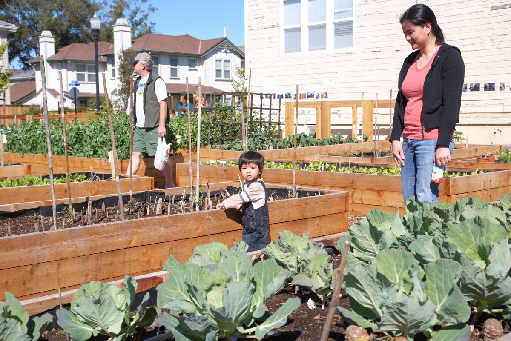

<small>
_[Photo](https://www.flickr.com/photos/usfsregion5/5809142932) by Flickr user [usfsregion5](https://www.flickr.com/photos/usfsregion5/), licensed under Creative Commons._
</small>

### Overview 

### Links

* [Vallejo Police Department website](http://www.ci.vallejo.ca.us/city_hall/departments___divisions/police)
* [Vallejo Police Department Facebook page](https://www.facebook.com/VallejoPD)

### Data

### News

* [KQED: "Questions Surround Surge in Vallejo Police Shootings"](http://ww2.kqed.org/news/vallejo-police-officer-named-in-three-fatal-shootings)
* [Vallejo Times-Herald: "Deputies launch night patrols to bolster shrunken city force"](http://www.timesheraldonline.com/ci_14416120)
* [Vallejo Times-Herald: "Brenda J. Crawford: A time for leadership"](http://www.timesheraldonline.com/letterstotheeditor/ci_26785582/brenda-j-crawford-time-leadership)
* [KQED: Vallejo](http://ww2.kqed.org/news/tag/vallejo)

### Conversation