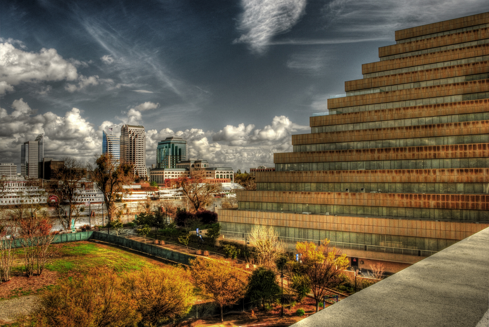

<small>
_[Photo](https://www.flickr.com/photos/cmkeiner/5557630150/in/photostream/) taken by Flickr user [cmkeiner](https://www.flickr.com/photos/cmkeiner/), licensed under Creative Commons._
</small>

### Overview 

_Things that fellows would want to know about the city. Ideas from the Google doc:_

* _Weather, Demographics, Urbanicity_
* _Is there a history of civic engagement? Does the city already have a Brigade?_
* _Community? Transportation (need a car)? Cost of living_
* _Is there a high income-disparity? If so, why/how?_
* _History: Is there a history of suspicion of local government?_
* _Geography. Industry. Blue collar? Hospitality? Creatives moving in? Is it “a city in transition?”_

### Allies

_Ideas from the Google doc:_

* _Key city gov departments related to focus topic._
* _Community organizations currently active in focus topic, especially groups that can provide guidance and feedback._
* _Local CfA brigade, civic hackers + former CfA fellows for guidance, feedback, getting up to speed._

### Data

_Data APIs and data sources:_

* *[Wikipedia](http://en.wikipedia.org/wiki/West_Sacramento,_California)*
* _[https://www.data.gov/developers/apis](https://www.data.gov/developers/apis)_
* _[Developers - US Census Bureau](http://www.census.gov/developers/#)_
* _[US City Open Data Census](http://us-city.census.okfn.org/)_
* _[Statistics of US Businesses](http://www.census.gov/econ/susb/)_
* _[ProPublica Data Store](https://projects.propublica.org/data-store/)_
* _[West Sacramento Open Data](https://data.cityofwestsacramento.org/)_
* _[City of West Sacramento Dept. of Business Development](http://cityofwestsacramento.org/business/default.asp)_
* _[City of West Sacramento Dept. of Community Development](http://cityofwestsacramento.org/city/depts/comdev/default.asp)_

### News

### Conversations 

### Photos